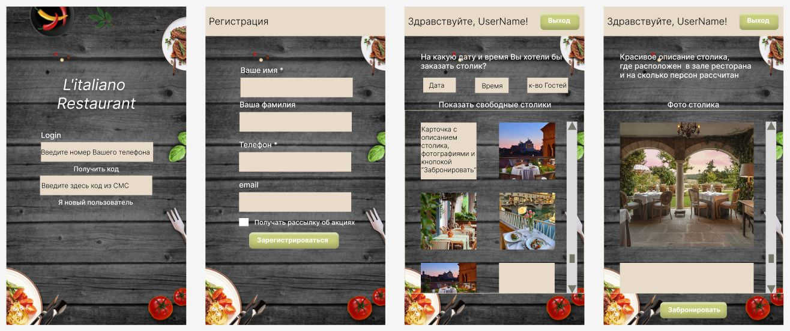

Для приложения заказа столика в ресторане сделать архитектурные документы:
1) Разработать экранные формы интерфейса(UI/UX) в https://www.figma.com/ или https://app.diagrams.net/.

2) Разработать полную ERD домена в https://www.dbdesigner.net/.

3) Разработать UML диаграмму классов.

